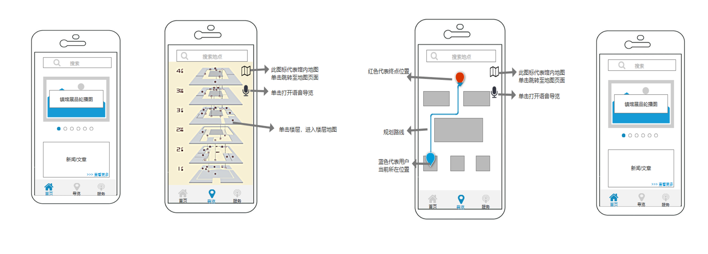

# 博物馆动静皆宜
|||
|--|--|
|文档名称|博物馆语音导览APP|
|文档负责人|陈熙|
|文档状态|已完成|
## 价值主张设计
- 一句话版本：本产品为用户提供博物馆语音导览服务，旨在提高用户游览博物馆的自由度和体验感。
- 一分钟版本：
本产品的重点功能为语音导览，在庞杂的博物馆中，首要解决的是游客最急迫的需求，所以调用地图开放平台的定位API等设计博物馆导览功能。其次，考虑到部分游客可能不想阅读文本或者存在导致阅读文本困难的生理障碍，调用了语音合成AI，让手机开口带用户游览，增加用户的体验感。
### 背景
- 随着人们精神需求的增长，参观展馆人数的增长，不同群体的参观习惯也不同，对此博物馆导览APP应运而生。
- 多动症患者与残障人士出行往往有诸多不便，他们在参观展馆时可能会有突发情况和特殊需求，但目前市面上未有针对残疾人群体的博物馆导览软件。
### 目标用户
- 参观博物馆的多动症患者及身障者
### 产品定位
针对多动症患者及身障人士的博物馆语音导览APP
### 加值宣言
- 地图API——定位、地图、搜索（主要）
对博物馆内的残障人士/多动症患者参观者进行实时定位和路径规划，让残障人士/多动症患者无需依赖工作人员和标识指示轻松找到自己想要去的地方，满足他们最急切的需求，如最近的休息区域、厕所、出口等。
- 语音合成（次要）
基于业界领先的深度神经网络技术，提供高度拟人、流畅自然的语音合成服务，让APP开口说话，解放用户，为残障人士/多动症患者提供语音导览服务。
### 核心价值
- 为残障人士/多动症患者提供博物馆内实时路径规划和语音导览服务，解决他们游览过程中的突发需求，提高游览的自主性和个性化。
### 用户痛点
- 面对突发需求，无法准确理解路标指引，找不到工作人员
- 在展馆中迷路，无法知道自己的位置且找不到工作人/标识指引
- 因为生理障碍无法阅读文本
### 用户需求
|用户案例	|对应接口|重要程度|
|--|--|--|
|用户想要知道如何去最近的出口/厕所/休息区|地图API（定位、地图）	|最重要|
|用户在展馆中迷路|地图API（定位）|重要|
|用户不想/无法阅读路径规划文本|语音合成|	重要|
#### 具体应用场景
- 场景一：用户a是一名多动症患者，在参展过程发病自己行为亢奋，想要找到出口，离开展区。这时他通过APP的实时路径规划找到最近的出口
- 场景二：用户b患有阅读障碍症，他在展馆中迷路了，这时它通过APP的实时定位和语音播报找到了路。
### 产品目的
- 满足多动症患者及身障人士游览博物馆时的突发需求，提高游览的自主性、个性化和体验感。
- 解决特殊用户无法使用文本的障碍。
### 产品原型
- 产品原型图展示

- 点击查看[产品原型](https://heeya-pol.github.io/API_museum/)
- 点击跳转至[原型下载区](https://github.com/HEEya-pol/API_museum)

### API的使用
1.[高德地图API文档](https://lbs.amap.com/api/webservice/summary/)
<br>2.[百度智能硬件定位服务文档](http://lbsyun.baidu.com/index.php?title=webapi/intel-hardware-api)
- 请求代码示例

```{
	"ver": "1.0",
	"trace": false,
	"prod": "test_loc_api",
	"src": "baidu_loc_api",
    "key": "XXXXXXXXXXXXXXXXXXXXXXXXXXX",
	"body": [{
			"bts": "460,0,4189,8869,-63",
			"output": "JSON",
			"accesstype": 0,			           

"macs":"70:ba:ef:d0:87:91,-42,|70:ba:ef:d1:0e:01,-45,|70:ba:ef:cc:98:11,-56,|dc:fe:18:c9:94:ce,-87,|58:60:5f:68:d8:30,-89,|94:d9:b3:cf:a2:db,-91,|30:fc:68:ac:c6:ae,-91,|c8:3a:35:32:48:c8,-94,",
			"imei": "xxxxxxxxxxxxxxx",
			"ctime": "1551178833",			
"nearbts":"460,0,4189,33989,-81|460,0,4189,8868,-83|460,0,4189,33988,-84|460,0,4189,239,-86|460,0,4189,32659,-98|460,0,4189,8867,-99",
			"cdma": 0,
			"need_rgc": "Y",
			"network": "GPRS"
		},
		{
			"accesstype": 0,
			"imei": "xxxxxxxxxxxxxxx",
			"clientip": "232.111.11.240",
			"cdma": 0,
			"imsi": "xxxxxxxxxxxxxxx",
			"network": "GPRS",
			"bts": "510,11,25182,40081,-83",
			"macs": "e0:36:76:e8:11:78,-18,1",
			"coor": "bd09ll",
			"output": "JSON",
			"ctime": "1551178833",
			"need_rgc": "Y"
		},
		{
			"accesstype": 0,
			"imei": "xxxxxxxxxxxxxxx",
			"cdma": 0,
			"imsi": "xxxxxxxxxxxxxxx",
			"network": "GSM",
			"bts": "460,0,4163,21297934,-124",
			"nearbts": "460,0,-1,-1,13|460,0,-1,-1,29",

"macs":"C8:E7:D8:33:B4:7C,-52,73cun|8C:A6:DF:DF:4B:14,-54,nolimit|E4:6F:13:CC:15:41,-57,weizhiweikeyong|E4:6F:13:CC:15:40,-64,WZWIT|66:14:4B:55:C8:48,-69,CMCC|54:B1:21:A6:81:D5,-73,HUAWEI-E5573-81D5|02:6B:E7:92:B1:73,-76,VANS|20:F4:1B:B6:9F:46,-78,ydnc",
			"coor": "GCJ02",
			"output": "JSON",
			"ctime": "1551178833",
			"need_rgc": "Y"
		}
	]
}
```

- 响应代码示例

```
{
 "errcode": 0,
    "msg": "Query success.",
    "body": [
        {
            "type": 2,
            "location": "116.298457,39.848625",
            "radius": 41,
            "country": "中国",
            "province": "北京市",
            "city": "北京市",
            "citycode": "131",
            "district": "丰台区",
            "road": "丰台南路44号",
            "ctime": "1551178833",
            "indoor": "1",
            "error": 0
        },
        {
            "type": 4,
            "location": "107.614218,-6.941022",
            "radius": 111,
            "country": "Indonesia",
            "province": "Jawa Barat",
            "city": "Bandung City",
            "citycode": "34544",
            "district": "",
            "road": "Jalan Sriwijaya",
            "ctime": "1551178833",
            "indoor": "0",
            "error": 0
        },
        {
            "type": 2,
            "location": "116.352743,39.941695",
            "radius": 15,
            "country": "中国",
            "province": "北京市",
            "city": "北京市",
            "citycode": "131",
            "district": "西城区",
            "road": "西直门外大街1号院-3号",
            "ctime": "1551178833",
            "bldg": "bjxcqkdmall",
            "bldgid": "1266783613064577023",
            "bldgname": "凯德MALL(西直门嘉茂店)",
            "floor": "f4",
            "indoor": "1",
            "error": 0
        }
    ]
}
```

3.[百度地图调起API服务文档](http://lbsyun.baidu.com/index.php?title=uri)
<br>4.百度语音合成<br>[百度语音合成技术文档](https://ai.baidu.com/ai-doc/SPEECH/Gk38y8lzk)<br>[调用流程示例](https://ai.baidu.com/ai-doc/SPEECH/0k38y8mfh)
<br>5.腾讯云语音合成<br>[API文档](https://cloud.tencent.com/product/tts/developer)<br>[代码示例](https://cloud.tencent.com/document/product/1073/37935)


### API的选择
##### 一、地图API
**（一）高德地图API**
1.搜索POI：搜索服务API是一类简单的HTTP接口，提供多种查询POI信息的能力，其中包括关键字搜索、周边搜索、多边形搜索、ID查询四种筛选机制。
<br>2.IP定位：根据用户输入的IP地址，能够快速的帮用户定位IP的所在位置。将IP信息转换为地理位置信息。
<br>3.[定价](https://lbs.amap.com/home/package?active=quota)

**（二）百度地图API**
1.智能硬件定位
- 功能：利用蓝牙、WI-FI、基站、GPS等信息，传给服务端进行处理，获取定位信息，完成地图、路线规划、轨迹等功能。适用于室内、室外多种定位场景，覆盖智能可穿戴设备、车载设备等。可判断当前定位点在室内或者室外，支持室内场景下返回建筑物名称、当前楼层信息。

<br>2.地图调起API
- 功能：为开发者提供直接调起百度地图产品，以满足特定业务场景下应用需求的程序接口，开发者只需按照接口规范构造一条标准的URI，便可在PC和移动端浏览器或移动开发应用中调起百度地图产品，进行地图展示和检索、线路查询、导航等功能，无需进行复杂的地图功能开发。 该套API免费对外开放，无需申请ak。只需构造一条标准规范的URL，便可直接调起百度地图产品。

[定价](http://lbsyun.baidu.com/index.php?title=FAQ/Concurrent)

##### 二、语音合成
**（一）腾讯云——语音合成**

1.功能：腾讯云语音合成可以把文字转换成拟人化的语音。
- 语种支持：
支持中文、英文以及中英文混读。
- 音色支持：
支持发声人选择，现阶段支持6种音色，3男3女，未来会增加更多音色。
- 语速调整：
支持0.6、0.8、1.0、1.2、1.5多种倍速率的合成语速。
- 音量调整：
支持1~10倍速率的合成音量。
- 实时性：
支持基础语音合成和实时语音合成两种模式。
- 采样率：
支持8K、16K两种采样率的合成效果。
<br>2.[定价](https://cloud.tencent.com/product/tts/pricing) 

**（二）百度AI——语音合成**
1.功能：
- 分为在线语音合成（基础、精品）和离线语音合成
- 提供多场景音库：
提供基础音库和精品音库共9种音库供您选择，适用于泛阅读、订单播报、智能硬件等应用场景，即将推出更多特色音库。
- 语速、音调可调节：
支持多种参数配置，可根据场景需求对音库的语速、音调、音量进行灵活设置，满足个性化需求
- 支持多音字标注：
中文多音字可通过标注拼音、音调自行定义发音，例如“轻舟已过万重（chong2）山”、“脑筋急转（zhuan3）弯”
- 多种调用方式，满足多场景需求：
提供REST API接口、在线离线融合SDK，满足不同网络环境下的语音合成需求，提供流畅自然的合成体验
<br>2.[定价](https://ai.baidu.com/ai-doc/SPEECH/Nk38y8pjq)


### 人工智能概率性
1.实时定位导航
- 可能受网络、其他信号的干扰、GPS信号弱等问题影响定位的准确性，从而导致路径规划出错、延迟。
- 室内布局变更频繁，地理数据获取难度很大
<br>2.语音合成
- 受多音字、语种等问题的影响可能会出现语音播报模糊
### API使用风险报告
##### 定位导航
- 室内布局变更频繁，地理数据获取难度很大，成本高
- 对用户位置信息隐私保护难度大，要求高
- 资料：<br>[室内导航系统商业计划书]([https://wenku.baidu.com/view/ca44b087aeaad1f347933f05.html](https://wenku.baidu.com/view/ca44b087aeaad1f347933f05.html)
)<br>[室内定位技术的市场机遇与风险分析](https://wenku.baidu.com/view/b296f9b26bdc5022aaea998fcc22bcd126ff423f.html)<br>[室内导航最难的是啥？](https://www.jianshu.com/p/97c163cb2b77)
##### 语音合成
- 语音合成自然度比较低，文本转换能力还有待提升
- 资料：<br>[解决语音合成技术，还需要做出怎样的努力？](https://www.jianshu.com/p/1584089440c2)<br> [方兴未艾的语音合成技术与应用](https://www.jianshu.com/p/837c31aa1cb0)


